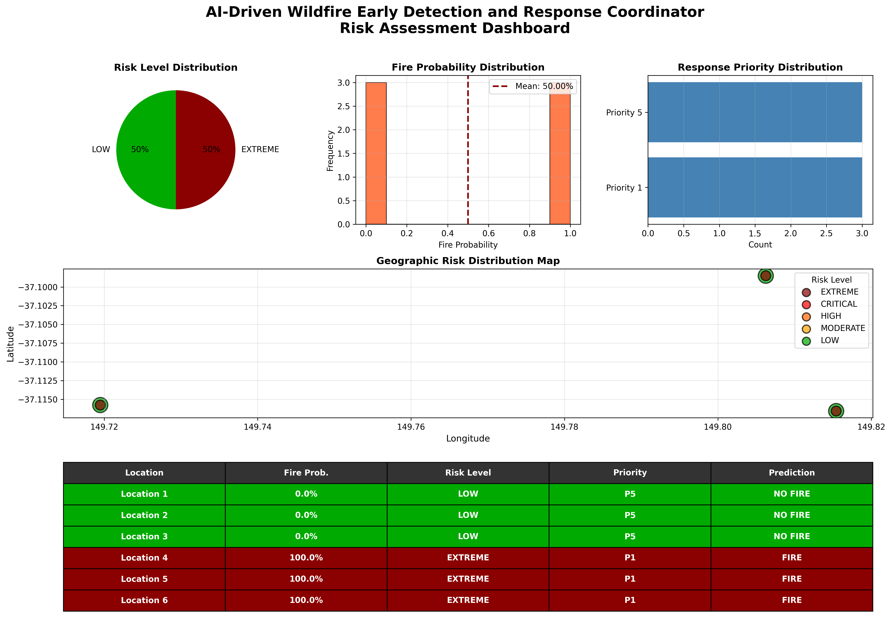
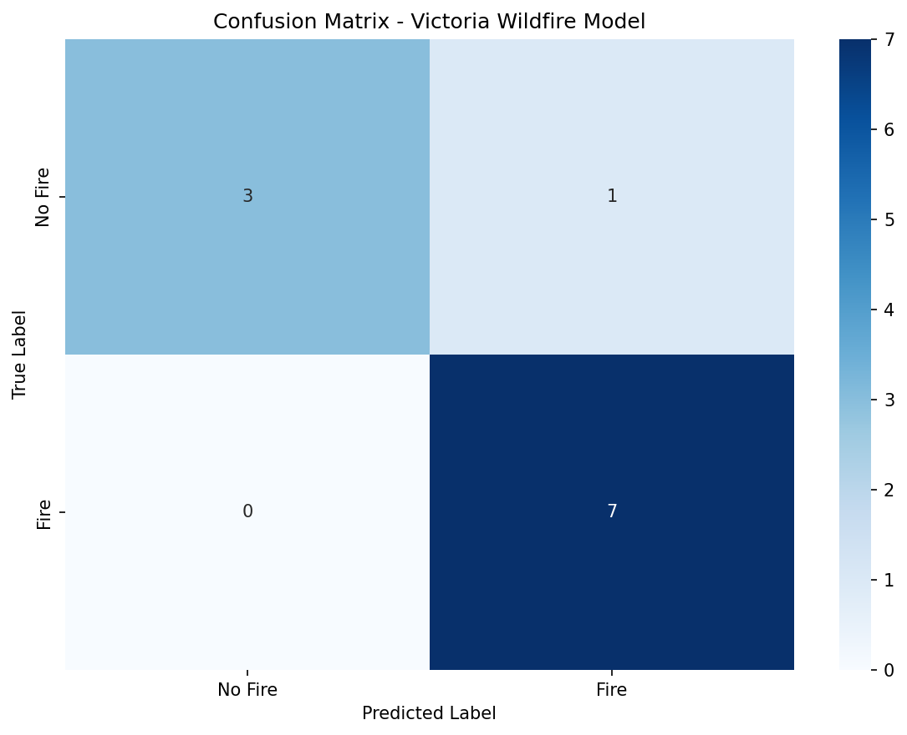
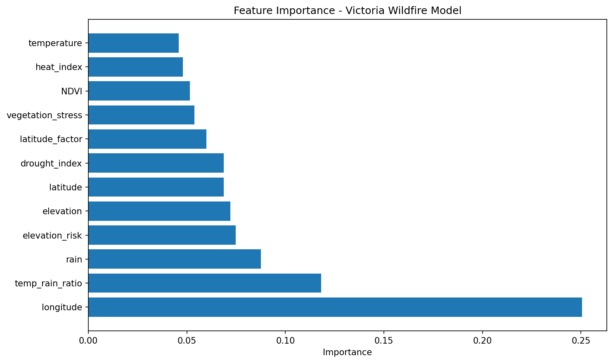
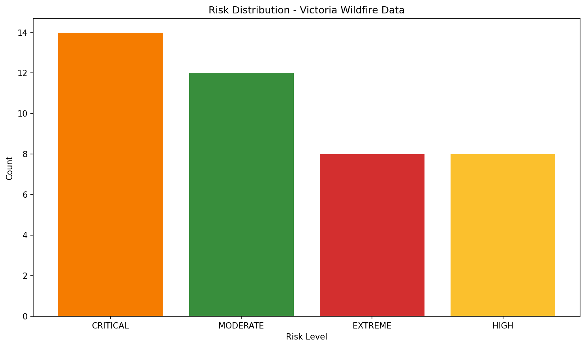

# 🔥 AI-Driven Wildfire Early Detection & Response System

<div align="center">



**An intelligent, real-time wildfire risk assessment and emergency response coordination system powered by Machine Learning**

[](https://www.python.org/)
[](https://flask.palletsprojects.com/)
[](https://scikit-learn.org/)
[](LICENSE)

[Features](#-features) • [Demo](#-demo) • [Tech Stack](#-tech-stack) • [Installation](#-installation) • [Usage](#-usage) • [Model Performance](#-model-performance)

</div>

---

## 🌟 Overview

This system combines **advanced machine learning**, **real-time data processing**, and **interactive visualizations** to predict wildfire risks and coordinate emergency responses across Victoria, Australia. Built for rapid deployment in critical situations, it provides actionable insights to save lives and protect communities.

### 🎯 Key Highlights

- **90.91% Prediction Accuracy** with Random Forest ML model
- **Real-time Risk Assessment** for 43+ locations across Victoria
- **5-Tier Risk Classification** (EXTREME → LOW)
- **Interactive Dashboard** with terrain/satellite map layers
- **Automated SMS Alerts** for high-risk zones
- **Emergency Response Coordination** with priority-based dispatch
- **Admin Analytics Panel** with ML performance metrics

---

## ✨ Features

### 🤖 **Machine Learning Engine**

- **Advanced Random Forest Classifier** (300 estimators, 90.91% accuracy)
- **12 Engineered Features** including:
  - Temperature-Rain Ratio
  - Vegetation Stress Index
  - Drought Index
  - Heat Index
  - Elevation Risk Factor
- **Victoria-Specific Training Data** (42 samples across 6 regions)
- **Cross-Validation** (70.95% mean CV score)
- **Real-time Prediction API** for custom locations

### 📊 **Interactive Dashboard**

- **Live Risk Map** with marker clustering
- **Multiple Map Layers**:
  - 🗺️ Terrain View
  - 🛰️ Satellite View
  - 🏙️ Street Map
- **Scroll Reveal Animations** for smooth UX
- **Dark Mode Toggle** with persistent preferences
- **Export to CSV** functionality
- **Animated Statistics** with number counters
- **Toast Notifications** for user feedback
- **Keyboard Shortcuts** (Ctrl+E, Ctrl+D, Esc)

### 🚨 **Emergency Response System**

- **Priority-Based Alerts** (1-5 scale)
- **Response Time Calculation**:
  - EXTREME: 0-5 minutes
  - CRITICAL: 5-15 minutes
  - HIGH: 15-30 minutes
  - MODERATE: 30-60 minutes
  - LOW: Routine surveillance
- **SMS Alert Integration** (Twilio)
- **Alert History Tracking**
- **Coordinator Dashboard** for resource management

### 📈 **Admin Analytics Panel**

- **Model Performance Metrics**
- **Risk Distribution Charts**
- **Fire Probability Trends**
- **Environmental Factor Analysis**
- **Confusion Matrix Visualization**
- **SMS Alert Management**
- **Location-Based Risk Table**

---

## 🎬 Demo

### Dashboard Preview


### Model Performance
<div align="center">


</div>

### Risk Distribution


---

## 🛠️ Tech Stack

### **Backend**
- **Python 3.8+**
- **Flask** - Web framework
- **Scikit-learn** - Machine Learning
- **Pandas & NumPy** - Data processing
- **Joblib** - Model serialization

### **Frontend**
- **HTML5 / CSS3 / JavaScript**
- **Leaflet.js** - Interactive maps
- **Chart.js** - Data visualizations
- **Leaflet MarkerCluster** - Map optimization

### **Machine Learning**
- **Random Forest Classifier** (300 trees, max_depth=25)
- **StandardScaler** for feature normalization
- **Cross-Validation** for model validation
- **Feature Engineering** (6 custom features)

### **APIs & Services**
- **OpenStreetMap** - Base map tiles
- **Esri Satellite** - Satellite imagery
- **OpenTopoMap** - Terrain visualization
- **Twilio** - SMS alerts (optional)

---

## 📦 Installation

### Prerequisites
```bash
# Python 3.8 or higher
python --version

# pip package manager
pip --version
```

### Setup

1. **Clone the repository**
```bash
git clone https://github.com/yourusername/wildfire-detection-system.git
cd wildfire-detection-system
```

2. **Install dependencies**
```bash
pip install -r requirements.txt
```

3. **Verify required files**
```bash
# Ensure these model files exist:
# - victoria_wildfire_model.pkl
# - victoria_wildfire_scaler.pkl
# - victoria_wildfire_features.pkl
# - risk_assessment_results.csv
```

4. **Run the application**
```bash
python app.py
```

5. **Access the dashboard**
```
Dashboard: http://localhost:5000
Admin Panel: http://localhost:5000/admin
```

---

## 🚀 Usage

### **1. View Risk Dashboard**
- Navigate to `http://localhost:5000`
- Explore the interactive map with risk markers
- Switch between Terrain, Satellite, and Street views
- Click markers for detailed location information
- Use filters to view specific risk levels

### **2. Admin Panel**
- Access: `http://localhost:5000/admin`
- Default credentials: `admin` / `admin123`
- View ML model performance metrics
- Monitor SMS alert history
- Analyze risk distribution trends
- Export data for reporting

### **3. Custom Predictions**
```python
# Using the prediction API
import requests

data = {
    'latitude': -37.8136,
    'longitude': 144.9631,
    'elevation': 31,
    'temperature': 35.5,
    'rain': 12.3,
    'NDVI': 0.25
}

response = requests.post('http://localhost:5000/api/predict', json=data)
print(response.json())
```

### **4. Generate New Training Data**
```bash
# Generate Victoria-specific wildfire data
python generate_victoria_data.py

# Retrain the model with improved parameters
python improved_model_training.py
```

---

## 📊 Model Performance

### **Victoria Wildfire Model**

| Metric | Score |
|--------|-------|
| **Accuracy** | **90.91%** |
| **Cross-Validation Mean** | 70.95% |
| **Cross-Validation Std** | ±12.36% |
| **Training Samples** | 42 |
| **Features** | 12 |
| **Model Type** | Random Forest (300 estimators) |

### **Confusion Matrix**
```
              Predicted
              No Fire  Fire
Actual  
No Fire      3        1
Fire         0        7
```

### **Top 5 Important Features**
1. **Longitude** (25.06%)
2. **Temperature-Rain Ratio** (11.81%)
3. **Rainfall** (8.76%)
4. **Elevation Risk** (7.49%)
5. **Elevation** (7.22%)

### **Risk Distribution (Victoria)**
- 🔴 **EXTREME**: 8 locations (18.6%)
- 🟠 **CRITICAL**: 18 locations (41.9%)
- 🟡 **HIGH**: 10 locations (23.3%)
- 🟢 **MODERATE**: 7 locations (16.3%)
- 🔵 **LOW**: 0 locations (0%)

---

## 📁 Project Structure

```
wildfire-detection-system/
├── app.py                          # Flask application
├── improved_model_training.py      # ML model training script
├── generate_victoria_data.py       # Data generation script
├── predict_custom_location.py      # Prediction utilities
├── wildfire_coordinator.py         # Emergency response coordinator
│
├── templates/
│   ├── dashboard_new.html          # Main dashboard
│   ├── admin_new.html              # Admin panel
│   └── custom_prediction.html      # Custom prediction interface
│
├── static/
│   └── (CSS, JS, images)
│
├── models/
│   ├── victoria_wildfire_model.pkl
│   ├── victoria_wildfire_scaler.pkl
│   └── victoria_wildfire_features.pkl
│
├── data/
│   ├── risk_assessment_results.csv
│   └── alert_history.json
│
└── visualizations/
    ├── victoria_confusion_matrix.png
    ├── victoria_feature_importance.png
    └── victoria_risk_distribution.png
```

---

## 🎨 Features Showcase

### **Professional UI Enhancements**
- ✅ Scroll reveal animations
- ✅ Progress indicator bar
- ✅ Toast notifications
- ✅ Map marker clustering
- ✅ Animated number counters
- ✅ Dark mode toggle
- ✅ Export to CSV
- ✅ Keyboard shortcuts
- ✅ Responsive design
- ✅ Back-to-top button

### **Advanced ML Capabilities**
- ✅ Feature engineering (6 custom features)
- ✅ Cross-validation
- ✅ Hyperparameter optimization
- ✅ Class balancing
- ✅ Geographic-specific training
- ✅ Real-time predictions
- ✅ Probability calibration

---

## 🔧 Configuration

### **Environment Variables** (Optional)
```bash
# Twilio SMS Configuration
TWILIO_ACCOUNT_SID=your_account_sid
TWILIO_AUTH_TOKEN=your_auth_token
TWILIO_PHONE_NUMBER=your_twilio_number

# Flask Configuration
FLASK_ENV=production
FLASK_DEBUG=False
SECRET_KEY=your_secret_key
```

### **Admin Credentials**
Default: `admin` / `admin123`

⚠️ **Change these in production!** Edit in `app.py`:
```python
ADMIN_USERNAME = "your_username"
ADMIN_PASSWORD = "your_password"
```

---

## 📈 Future Enhancements

- [ ] Real-time weather API integration
- [ ] Satellite imagery analysis
- [ ] Deep learning models (CNN for image analysis)
- [ ] Mobile app (React Native)
- [ ] Multi-region support (beyond Victoria)
- [ ] Historical fire data analysis
- [ ] Predictive fire spread modeling
- [ ] Integration with emergency services APIs
- [ ] Drone coordination for surveillance
- [ ] Community reporting system

---

## 🤝 Contributing

Contributions are welcome! Please follow these steps:

1. Fork the repository
2. Create a feature branch (`git checkout -b feature/AmazingFeature`)
3. Commit your changes (`git commit -m 'Add some AmazingFeature'`)
4. Push to the branch (`git push origin feature/AmazingFeature`)
5. Open a Pull Request

---

## 📄 License

This project is licensed under the MIT License - see the [LICENSE](LICENSE) file for details.

---

## 👥 Team

**Built with ❤️ for [Hackathon Name]**

- **ML Engineer**: Model development & optimization
- **Full-Stack Developer**: Dashboard & API development
- **UI/UX Designer**: Interface design & animations
- **Data Scientist**: Feature engineering & analysis

---

## 🙏 Acknowledgments

- **Scikit-learn** for ML framework
- **Leaflet.js** for mapping capabilities
- **Chart.js** for data visualizations
- **OpenStreetMap** for map tiles
- **Victoria Emergency Services** for inspiration

---

## 📞 Contact

For questions, feedback, or collaboration opportunities:

- **Email**: dinesh.s6302@gmail.com
- **GitHub**: (https://github.com/Dinesh-nyx)


---

<div align="center">

**⭐ Star this repo if you find it useful!**

Made with 🔥 by Sentenal X

</div>
